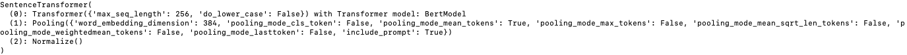

# Sentence Similarity


## Overview

This script calculates the cosine similarity between pairs of sentences read from a text file, leveraging embeddings to represent the sentences numerically. It uses these embeddings to compute the similarity and sorts the pairs by their similarity score in descending order. The result is a Pandas DataFrame showcasing the top pairs with the highest similarity scores.


## Usage
To use this script, ensure you have a text file with sentences you wish to compare. The file should contain one sentence per line and named "data.txt". Then, follow these steps:

Prepare the environment by installing the required packages: numpy, pandas, and any specific library needed for calculating embeddings and cosine similarity.
Place your sentences text file in a known directory.

To run the script, simply use python run.py from your command line or terminal.

```sh
python run.py
```

## Example Output

The output will be a Pandas DataFrame printed to the console, showing the top pairs of sentences with their similarity scores, sorted in descending order.


## Model
The model used is all-MiniLM-L6-v2 from sentence transformers



## How It Works

The script operates in several key steps:

1. **Loading Sentences**: Sentences are loaded from a text file into a list, where each line in the file represents a distinct sentence.
2. **Generating Embeddings**: For each sentence, an embedding is generated, creating a numerical representation of the sentence. This step assumes the existence of a `getEmbeddingsAsDictionary` function that maps each sentence to its corresponding embedding and returns a dictionary where the keys are the sentences and the values are their embeddings.
3. **Comparing Sentences**: The script iterates through pairs of sentences, calculating the cosine similarity between their embeddings. These similarities are stored along with the sentence pairs in a list of dictionaries.
4. **Sorting and Displaying Results**: The list of dictionaries is converted into a Pandas DataFrame for easy manipulation and analysis. The DataFrame is sorted by similarity in descending order to prioritize the most similar sentence pairs. Finally, the script prints the top results, providing insights into which sentences are most similar to each other.

## Mean pooling

The embeddings are implicitly created from the model using mean pooling.

In the application of sentence similarity, mean pooling serves to condense the information from token-level embeddings into a single vector that represents the entire sentence. This process unfolds in three main steps:

1. **Sentence Embedding Generation**: Individual tokens (words or subwords) within sentences are transformed into embeddings using a model. This results in a matrix where each row corresponds to a token's embedding.

2. **Mean Pooling**: The matrix of token embeddings for each sentence is averaged across all tokens, leading to a single vector that encapsulates the sentence's overall semantic information. This step effectively distills the essence of the sentence into a compact form.


Overall, mean pooling is a critical step in transforming detailed token-level data into actionable, sentence-level embeddings that can be compared for similarity, enabling a wide range of applications in natural language processing, from information retrieval to semantic analysis.

## Key Components

- `loadSentencesFromFile()`: Function to load sentences from a text file. Each line in the file is considered a separate sentence.
- `getEmbeddingsAsDictionary(sentences)`: Function that takes a list of sentences and returns a dictionary mapping each sentence to its embedding.
- `compare(result)`: Function that takes the result of `getEmbeddingsAsDictionary` and computes the cosine similarity between all pairs of sentences, returning a sorted DataFrame with the results.


## Requirements

- Python 3.x
- Pandas
- NumPy
- Libraries for computing embeddings and cosine similarity (e.g., scikit-learn for cosine similarity)
- sentence_transformers

Ensure all dependencies are installed using pip:

```sh
pip install pandas numpy scikit-learn sentence_transformers
```

## Final Note

This script is a powerful tool for analyzing the similarity between sentences, useful in various natural language processing tasks. Customize it according to your specific requirements by modifying the embedding generation process or adjusting the similarity threshold as needed.
